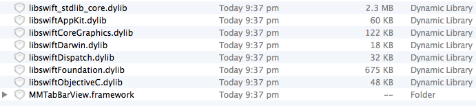
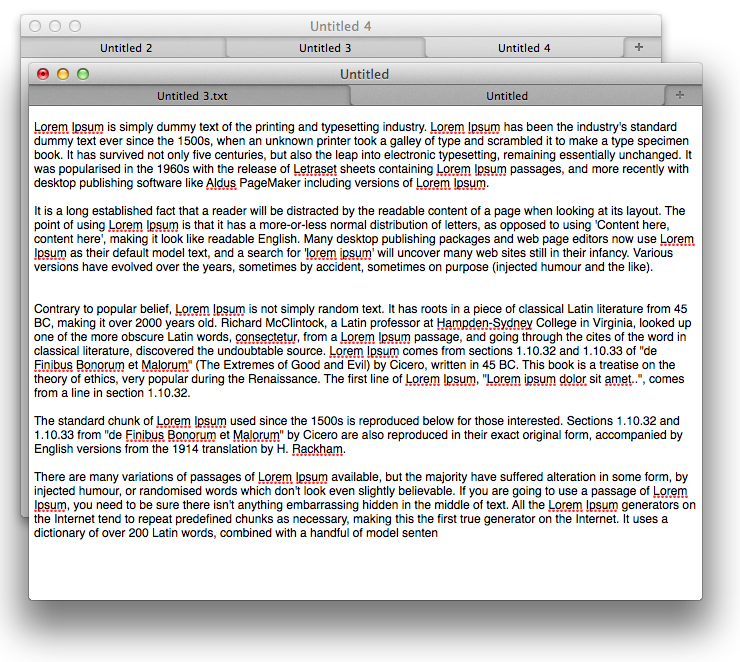

#SwiftTabDocument

Simple swift document based app that supports multi-documents within a window controller. Utilises [MMTabBarView](https://github.com/MiMo42/MMTabBarView) for safari-like tabs. 

##Download

[SwiftTabDocument.dmg (1.4Mb)](https://github.com/sjhorn/SwiftTabDocument/raw/master/SwiftTabDocument.dmg)  
Note: the swift libs bulk things up a bit

## Copying
MMTabbarView components and lines originally were created by Positive Spin Media. The original is BSD licensed.  
See: http://www.positivespinmedia.com/dev/PSMTabBarControl.html License 
The re-write is also BSD licensed. 
Since 2005 there have been lots of commits by various contributors. 
Thanks to the guys recently improved PSMTabBarControl and inspired me to finally do the re-write!

## License
Copyright © 2014, Hornmico Pty Ltd. All rights reserved. 
Copyright © 2005, Positive Spin Media. All rights reserved. 
Copyright © 2012, Michael Monscheuer. All rights reserved. 

Redistribution and use in source and binary forms, with or without modification, are permitted provided that the following conditions are met:

<pre><code>* Redistributions of source code must retain the above copyright notice, this list of conditions and the following disclaimer.
* Redistributions in binary form must reproduce the above copyright notice, this list of conditions and the following disclaimer in the documentation and/or other materials provided with the distribution.
* Neither the name of Positive Spin Media nor the names of its contributors may be used to endorse or promote products derived from this software without specific prior written permission.
</code></pre>

THIS SOFTWARE IS PROVIDED BY THE COPYRIGHT HOLDERS AND CONTRIBUTORS "AS IS" AND ANY EXPRESS OR IMPLIED WARRANTIES, INCLUDING, BUT NOT LIMITED TO, THE IMPLIED WARRANTIES OF MERCHANTABILITY AND FITNESS FOR A PARTICULAR PURPOSE ARE DISCLAIMED. IN NO EVENT SHALL THE COPYRIGHT OWNER OR CONTRIBUTORS BE LIABLE FOR ANY DIRECT, INDIRECT, INCIDENTAL, SPECIAL, EXEMPLARY, OR CONSEQUENTIAL DAMAGES (INCLUDING, BUT NOT LIMITED TO, PROCUREMENT OF SUBSTITUTE GOODS OR SERVICES; LOSS OF USE, DATA, OR PROFITS; OR BUSINESS INTERRUPTION) HOWEVER CAUSED AND ON ANY THEORY OF LIABILITY, WHETHER IN CONTRACT, STRICT LIABILITY, OR TORT (INCLUDING NEGLIGENCE OR OTHERWISE) ARISING IN ANY WAY OUT OF THE USE OF THIS SOFTWARE, EVEN IF ADVISED OF THE POSSIBILITY OF SUCH DAMAGE.

